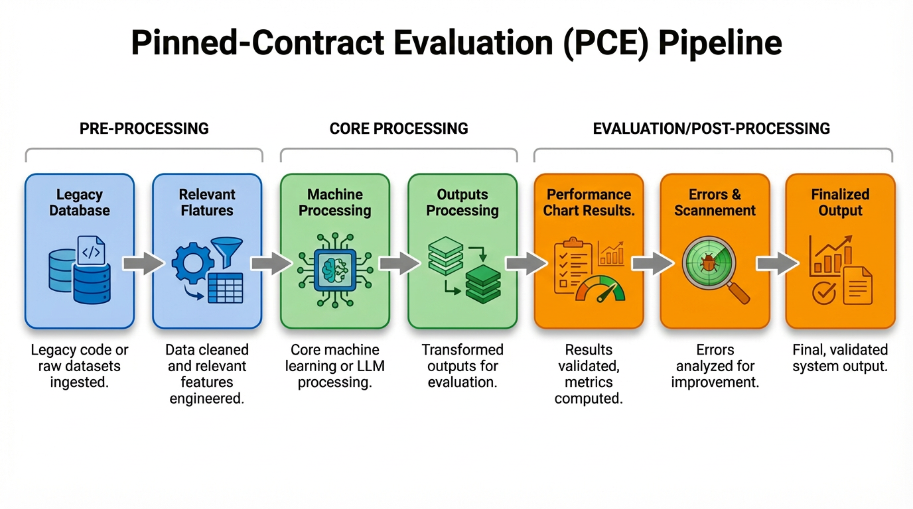

# Pinned-Contract Evaluation for LLM-Assisted PHP Migration

This repository contains the artifact for the paper:

**Pinned-Contract Evaluation: A Policy-Grounded Framework for Evaluating LLM Code Migration**

It includes the full migration and evaluation workflow: benchmark construction, LLM migration, pinned-contract scoring with Rector, and cross-oracle diagnostics.

## Pipeline Overview



Pinned-Contract Evaluation (PCE) operationalizes migration progress as **obligation discharge** under a fixed Rector policy. It is complemented by secondary diagnostics such as syntax validity, structural preservation, loadability, PHPCompatibility, and cross-oracle correlations.

## What Is Included

- Pinned PHP upgrade contract (`rector.php`) with locked toolchain versions.
- Benchmark construction scripts.
- Multi-model LLM migration harness.
- Evaluation scripts for discharge, patch-volume closure, loadability, and cross-oracle analysis.
- Reproducibility lock checks (`reproducibility.lock.json`, `verify_reproducibility.ps1`).

## Repository Layout

- `dataset/`
  - Dataset extraction, Rector report generation, file selection, and benchmark documentation.
- `LLM_Migration/`
  - Provider clients, prompting/chunking/reconstruction pipeline, migration scripts.
- `LLM_eval/`
  - PCE scoring, diff-count analysis, PHPCompatibility, loadability, resistant-rule and correlation analysis.
- `tests/wordpress/`
  - Runtime/loadability and comparison utilities.
- `verify_reproducibility.ps1`
  - Environment and lock-state validation.

## Local Tree Guide

Use this simplified tree as a quick local navigation map.

```text
Pinned-Contract-Evaluation/
├─ composer.json
├─ config.py
├─ rector.php
├─ rector_analyzer.py
├─ reproducibility.lock.json
├─ run_paper_tables.ps1
├─ verify_reproducibility.ps1
├─ dataset/
│  ├─ analyze_triggered_rules.py
│  ├─ create_reports.py
│  ├─ extract_php_files.py
│  ├─ generate_documentation.py
│  ├─ process_all_files.py
│  ├─ select_optimal_files.py
│  ├─ organized_dataset_All/wordpress/
│  └─ wordpress/
│     ├─ rector_reports_organized_dataset_All/
│     ├─ rector_reports_selected_100_files/
│     └─ selected_100_files/
├─ LLM_Migration/
│  ├─ main.py
│  ├─ analyze_migrated_code.py
│  ├─ requirements.txt
│  ├─ core/
│  ├─ scripts/
│  └─ wordpress/
│     ├─ chunked_model_output/
│     ├─ model_output/
│     └─ outputs/
├─ LLM_eval/
│  ├─ run_evaluation.py
│  ├─ run_phpcompatibility.py
│  ├─ summarize_phpcs.py
│  └─ wordpress/
│     ├─ <model_name>/
│     ├─ diff_count_analysis/
│     ├─ phpcompatibility_results/
│     └─ stats/
├─ tests/wordpress/
└─ vendor/
```

Notes:
- `dataset/` prepares benchmark files and Rector obligation reports.
- `LLM_Migration/wordpress/` stores generation artifacts from model migration runs.
- `LLM_eval/wordpress/` stores per-model evaluation outputs and aggregate statistics.

## Download and Setup Instructions

Download links for large artifacts will be published after camera-ready archival.

1. Download the artifact bundle:

   `[PLACEHOLDER_ARTIFACT_BUNDLE_URL]`

2. Extract the archive.

3. Place extracted files into the project directory using this structure:

```text
dataset/
├─ wordpress/
└─ organized_dataset_All/

LLM_Migration/wordpress/
├─ model_output/
├─ chunked_model_output/
└─ outputs/

LLM_eval/wordpress/
├─ <model_name>/
├─ phpcompatibility_results/
├─ stats/
└─ diff_count_analysis/

tests/
└─ wordpress/
```

### Important Notes

- Do not rename any folders.
- Keep the directory structure exactly the same.
- Ensure all files are fully extracted before running scripts.
- Misplaced files may cause errors in:
  - `process_all_files.py`
  - `run_evaluation.py`
  - `run_phpcompatibility.py`

### Run

```powershell
python LLM_eval\run_evaluation.py

# or

python dataset\process_all_files.py
```

When available, this link should point to an immutable, versioned archive (for example, a DOI-backed Zenodo record).

## Environment Requirements

- OS: Windows (reference environment recorded in lock file)
- PHP: `8.3.22` (CLI) with extensions listed in `reproducibility.lock.json`
- Composer
- Python 3.10+

### PHP Toolchain (Composer)

- `rector/rector` `2.1.0`
- `phpstan/phpstan` `2.1.17`
- `squizlabs/php_codesniffer` `3.13.5`
- `phpcompatibility/php-compatibility` `9.3.5`

### Python Dependencies

- `LLM_Migration/requirements.txt` (includes provider/client stack)
- Evaluation extras: `matplotlib`, `seaborn`, `scipy`

## Setup

1. Install PHP dependencies:

```powershell
composer install
```

2. Create a Python environment and install packages:

```powershell
python -m venv .venv
.\.venv\Scripts\Activate.ps1
pip install -r LLM_Migration\requirements.txt
pip install matplotlib seaborn scipy
```

3. Configure provider keys if running migrations:

```env
OPENROUTER_API_KEY=...
GOOGLE_API_KEY=...
ANTHROPIC_API_KEY=...
```

Place them in `.env` at repository root.

## Quick Start

### 1. Reproducibility preflight

```powershell
.\verify_reproducibility.ps1
```

Checks include runtime/tool version invariants, lock consistency, snapshot hashes, and baseline obligation denominator.

### 2. Run evaluation scripts directly

Use the commands in **Running Individual Components** to execute each analysis stage.

For a complete end-to-end example of the evaluation flow, see `run_full_evaluation.ps1` at the repository root.


## Running Individual Components

### LLM migration (example)

```powershell
python LLM_Migration\scripts\migrate.py --all-files --model claude-sonnet-4-20250514 --strategy basic
```

### Evaluate one model

```powershell
cd LLM_eval
python run_evaluation.py claude_sonnet_4_20250514
```

### Evaluate all discovered models

```powershell
cd LLM_eval
python run_evaluation.py all
```

### PHPCompatibility

```powershell
cd LLM_eval
python run_phpcompatibility.py
python summarize_phpcs.py
```

## Models Evaluated

- `claude_sonnet_4_20250514`
- `gemini_2_5_flash`
- `gemini_2_5_pro`
- `gpt_5_codex`
- `meta_llama_llama_3_3_70b_instruct`
- `Rector_Baseline`

## Key Results Snapshot

All-files weighted discharge summary:

| System | Weighted Discharge (%) | Discharged Obligations | Contract-Clean Files |
|---|---:|---:|---:|
| Rector (reference) | 98.43 | 503 | 89 |
| Gemini 2.5 Pro | 72.80 | 372 | 19 |
| GPT-5 Codex | 58.12 | 297 | 15 |
| Gemini 2.5 Flash | 53.42 | 273 | 13 |
| Claude Sonnet 4 (05-14) | 53.23 | 272 | 6 |
| Llama 3.3 70B Instruct | 30.53 | 156 | 2 |

## Reproducibility Notes

Pinned reproducibility state is tracked in `reproducibility.lock.json`, including:

- Runtime and environment invariants
- Exact tool versions
- Snapshot hash assertions
- Baseline obligation count (`511` `Rector\Php*` file-rule incidences)

For faithful reproduction, keep `composer.lock`, `reproducibility.lock.json`, and benchmark metadata unchanged.

## Citation

If you use this artifact, please cite:

```bibtex
@inproceedings{mahmud2026pce,
  title={Pinned-Contract Evaluation: A Policy-Grounded Framework for Evaluating LLM Code Migration},
  author={Mahmud, Afridi and Khondaker, Abid Hasan and Ahmed, Sadif and Rahman, Md Nafiu and Shahriyar, Rifat},
  year={2026},
  note={Artifact repository}
}
```

## License

No repository license file is currently included. Add one before public release if reuse permissions are intended.
